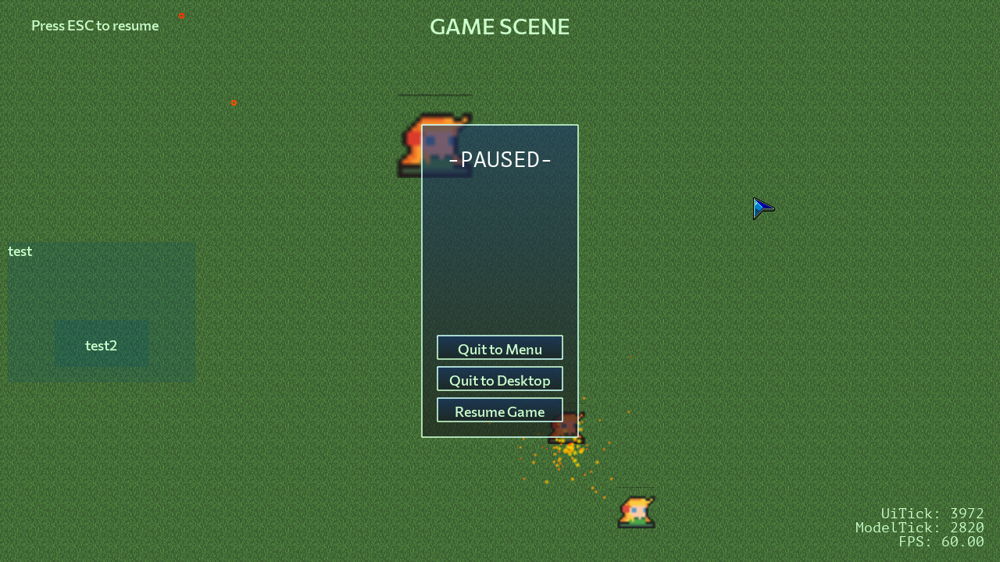

# Guide

NOTICE: Due to the project still being in rapid development and many APIs and functionalities subject to change, the detailed architecture is not documented, but should be evident from the code and comments. This guide instead focusses on big-picture descriptions and visions that would help to understand how the various parts cohere. Do contact the authors of this project if anything is unclear.

### Table of Contents
1. [Setting Up](#setup)
    1. [Prerequisites](#setup-prereqs)
    1. [Setting Up the Project on Your Computer](#setup-com)
    1. [Demo Features / Verifying the Setup](#demo-features)
1. [Design](#design)
    1. [Architecture](#architecture)
    1. [UiManager](#uimanager)
    1. [Scene](#scene)
	1. [Widgets](#widgets)
	1. [Model](#model)
1. [Coding Style](#coding-style)

## Setting Up 
### Prerequisites 
- Highly recommended: Latest version of [Code::Blocks](http://www.codeblocks.org)
- A C++ compiler with C++11 support (MinGW G++ already included with Code::Blocks)

### Setting Up the Project on Your Computer 
Windows:

- Clone this repo to your computer.
- Grab the libraries that are stated in the readme and put the .dlls in the same location as where the executable will be.
	- DLLs you will need: `freetype`, `SDL2`, `zlib1`
	- If you are using Code::Blocks, you can leave the DLLs in the root directory.
- Make sure your C++ compiler knows where to find the libraries and headers.
- Compile the source code with these options: `-DGLEW_STATIC -lmingw32 -lSDL2main -lSDL2 -lglew32s -lopengl32 -lfreetype`.
	- This is already set up for you if you have Code::Blocks on your computer: Just open the .cbp project file. Also find and include `libwinmm.a` in the Code::Blocks libs.
	- Note: The MinGW compiler will give a warning saying ".drectve \`/DEFAULTLIB:"LIBCMT" /DEFAULTLIB:"OLDNAMES" ' unrecognized". This warning is, from what I've read, due to an incompatibility with GLEW and MinGW, and is harmless. You just have to ignore it.
- Run the program and interact with it using the mouse and keyboard. You should see the screen below. Try out the features in the next subsection.

### Demo Features / Verifying the Setup 
- Currently, <kbd>Q</kbd> switches between the `MenuScene` and `GameScene`, as does clicking the Widget at the topleft of the screen.
- In the `GameScene`, there are three entities. The center entity is player-controlled.
	- <kbd>SPACE</kbd> pauses/unpauses the game.
	- <kbd>W</kbd><kbd>A</kbd><kbd>S</kbd><kbd>D</kbd> or <kbd>↑</kbd><kbd>↓</kbd><kbd>←</kbd><kbd>→</kbd> moves the player.
	- The player can bump the other two entities by moving into them.
	- The mouse can held down to make the player fire projectiles in the direction of the mouse. These projectiles can be fired at the other two entities to damage and eventually kill them. When killed, the entities explode into particles.
	- The mouse can also be used to hover over and click on the widgets on the left of the screen. Clicking them spawns particles.
	- The mouse may also be moved to the edges of the screen to pan the camera.
	- The camera can also be zoomed in and out by scrolling the mouse wheel.
	- The camera can be reset by clicking the mouse wheel.
- <kbd>F1</kbd> Toggles between fullscreen and windowed mode.
- <kbd>F2</kbd> Takes a screenshot of the game and saves it as a BMP in the project's root directory.
- Drag the window's edges to change its dimensions. <kbd>F3</kbd> Sets the dimensions to 1280x720.

## Design 
This section describes how the code base is organized.

### Architecture 

The `MainApp` hosts all the other components, and tracks application-wide data such as frames per second (FPS). It contains methods to initialize (`init()`), run (`run()`) and de-initialize (`deinit()`) the whole program. It also contains methods that allow `Message`s to affect its underlying data.

Independent of `MainApp` and indeed the rest of the program are the `Message` publisher-subscriber system, and the `Settings` system. Any component can publish `Message`s of any type, and subscribe to any type of `Message` by providing a callback function.

`Settings` is another singleton class that is told by `MainApp` on initialization to load values from a settings file (default: `data/settings.ini`). Note that setting names and values are case-sensitive. `Settings` may then be accessed from anywhere else in the program to access these values. On program deinitialization, `MainApp` tells `Settings` to save those same values to the settings file.

When the whole program starts, an instance of `MainApp` is created. `init()` is called to initialize the rest of the systems, then `run()`. `run()` executes an endless loop:

1. Poll for inputs
	1. `MainApp` tells the `UiManager` to collect raw inputs from the user and pass them to the `Scene`.
		- The `UiManager` may interpret and act on some of the input itself, in particular input from the window such as resizing and minimization. It transforms and passes the rest of the input to the `Scene`.
	2. `Scene` similarly processes some of the input itself, and passes the rest to the `WidgetManager` and `ModelManager`.
		1. Keyboard input is interpreted immediately.
		2. The `WidgetManager` is checked to see if the the mouse triggers any `Widget`s.
		3. If the mouse did not, the `ModelManager` is checked to see if the the mouse triggers any model events, such as clicking an entity.
2. If there were any `SceneTransitMessage`s posted, `MainApp` transits to the new `Scene` now.
3. `MainApp` tells the current `Scene` to update itself by 1 tick.
4. Draw
	1. `MainApp` tells `Scene` to draw, passing it a reference to the `UiManager`.
	2. `Scene` sets up `UiManager` and passes it to the `ModelManager` then `WidgetManager` (so that the `Widget`s are drawn on top of the model). The `WidgetManager` may also read from the model state to determine what to draw (e.g. to print a statistic).

When `run()` is exited, `deinit()` is called to clean up the rest of the system, then the program ends.

### UiManager 

The `UiManager` handles all low-level I/O, including setting up I/O functionality, maintaining I/O info, and providing an interface for the rest of the program to make I/O calls with. Specific duties include:

- Initializing and deinitializing I/O resources, such as the window, SDL, and OpenGL.
- Breaking down input - such as keyboard and mouse signals - to feed to `Scene`.
- Providing `Scene` an interface to make output calls to, such as display and audio.

The `UiManager` contains several subclasses to handle specialized areas:

- `MouseState`, `KeyboardState` are used to record the input state of the input devices.
- `ShaderProgram` defines and provides an interface for the shader program used by OpenGL. In particular, it helps to load and compile GLSL shader code, and defines an interface to load uniform values into them.
- `SpriteManager` handles `Sprite`s: all graphical elements are `Sprite`s. There are two main kinds of `Sprites`: `TexturedSprite`s which host and render a texture, and `GeometricSprite`s which render coloured geometric primitives.
	- `Texture`s handle individual image loading and handling with OpenGL.
	- `Sprite`s handle how to render things: VAOs and VBOs. They expose a `draw()` function, which would draw their data. It is up to the `UiManager` to specify parameters to the `ShaderProgram` to transform this output to the desired position and scale.
	- The `SpriteManager` lets the developer specify and load all the `Sprite`s to be used in the game. It is supported by a `SpriteId` enum.
- `TextManager` loads fonts and generates textures for each character of each typeface and font size, each managed by their own `GlyphSprite` class.
	- The `GlyphSprite`s are managed by `TextManager`, separately from the `SpriteManager`.
	- `TextManager`'s API only allows to print individual characters; an actual string of text is handled by `UiManager` since that requires UI position transformations from one character to the next, which is out of the scope of `TextManager`.

### Scene 

The `Scene` is the core of the game. It is conceptually split into two sections: The UI - handled by the `WidgetManager` - and the Model - handled by the `ModelManager`.

Furthermore, There are different derivatives of `Scene`, corresponding what what environments the player might encounter while navigating the app. In particular, there is currently a `MenuScene` - the environment of the main menu and game lobby, and a `GameScene` - the actual game environment. The `MainApp` tracks one `Scene`, which it can construct and destruct as needed.

The `Scene` has three external functionalities:
- Accept user input and interpret them into actions on itself, based on its current state. User input is in terms of keyboard and mouse events and state, and would typically be called from the `UiManager`, although they can technically be called from anywhere.
- Update its internal state (by one game tick).
- Tell a `UiManager` how to draw its state.

### Widgets 
The `WidgetManager` handles the GUI of the `Scene`. The GUI is defined in terms of `Widget`s. `Widget`s essentially define a region in screen space. They may have a defined action upon being clicked, and also have a defined draw function to visually indicate where they are when the app runs. They can be used to display information such as text, or provide a region for the player to click in order to activate a certain function. `Widget`s are overlaid onto the screen, and are always drawn on top of any other object from the Model.

### Model 

The Model contains the actual state of the game, as well as methods to interact with them, update them, and draw them to a given `UiManager`. The parent `Scene` may pass commands to the Model directly, or it may also pass user input to the `WidgetManager` which would then translate them into Model commands.

While the `GameScene` makes the heaviest use of the Model, other `Scene`s may also use the Model to display backdrops and animations.

The `ModelManager` is a base class that tracks timing information about the game state, exposes a `ModelCamera` that helps the `UiManager` define the conversion between game and screen coordinates, and defines methods on updating its own state based on input or a game tick. Its derivatives such as `GameModelManager` would track actual game entities using `EntityManager`s, and define further methods to manipulate the game entities, such as spawning new entities.

## Coding Style 
- Casing:
	- Variables: lowerCamelCase
	- Constants (including enum values): ALLCAPS_SNAKE_CASE
	- Functions: lowerCamelCase
	- Types (e.g. classes, typedefs, enums): UpperCamelCase
	- Abbreviations (such as "UI") should be treated as a regular word (e.g. "Ui"). "SDL" and "GL"/"OpenGL" are exceptions.
- Opening braces (`{`) should be on the same line as the statement that initiates that code block. e.g. `if (...) {`, `for (...) {`.
- Classes and files:
	- Classes should have their declaration in header (.hpp) files and implementation in source (.cpp) files.
		- A header file should have only one main class, but can also have auxiliary classes, typedefs, structs, enums etc.
		- Large classes (such as `UiManager`) may have multiple source files, each addressing a separate concern of the class.
		- Separate classes should be separated by 3 blank lines.
	- The header file and .cpp file should have the same name as the main class.
	- All header files must have a preprocessor guard `#define` in ALLCAPS_SNAKE_CASE, spelling out the name of the file including the ".hpp" e.g. `MainApp.hpp` -> `MAIN_APP_HPP`.
	- The main source file should `#include` the corresponding header file on its very first line, followed by a blank line.
	- All `#include`s must go at the beginning of the file. In header files, they come right after the header guard. In .cpp files, they come right after the main class `#include`.
	- `#include`s are arranged in order: STL; 3rd party dependencies; internal dependencies.
	- Classes should define `public` members first, then `protected` and `private` members.
	- All classes should have an explicit constructor and destructor.
	- The constructor and destructor should be public, unless the class follows a singleton pattern.
- All `switch` statements should have a `default` case.
- Enum values should be preceded by the enum's name. e.g. The "FontId" enum has values whose names start with "FONT_ID_".
